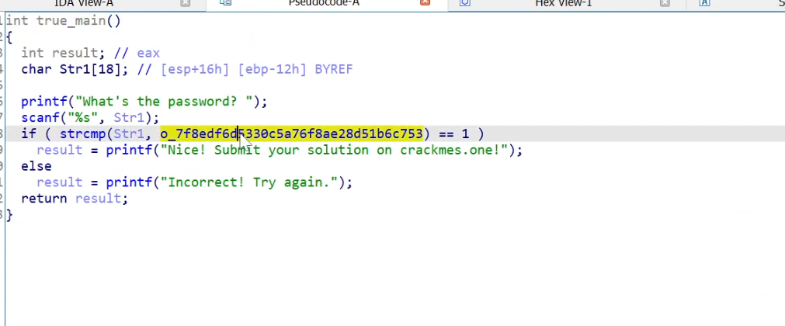
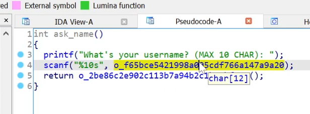
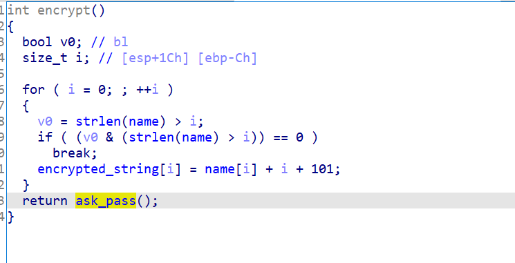
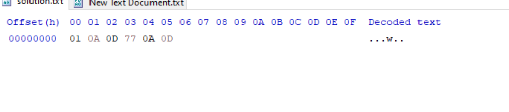

crackme

RedXen's Learning C CrackMe

Print characters
1..128 | %{"$_ $([char]$_)"}

to feed input to a file and get output from the program
Get-Content solution.txt | .\learningccrackme.exe > output.txt

This function compares the password entered with a dynamically built string and if it has a bigger char then you won

This function asks for the username

This function encrypts the name and sets the variable that you have to bypass in the password compare section

Solution:

To send solution:
Get-Content solution.txt | .\learningccrackme.exe > output.txt
