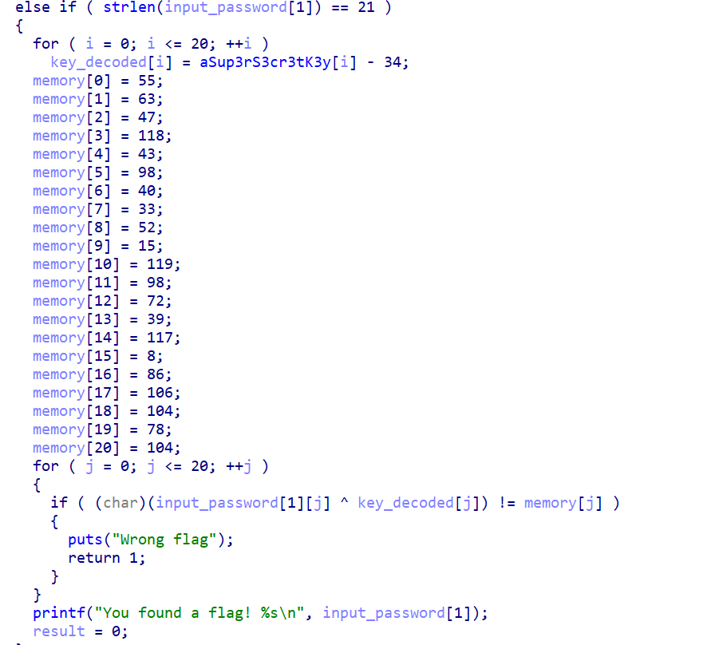

f0rizen's find a real key

to run a program in gdb with arguments
$ gdb ./a.out
(gdb) r arg1 arg2 arg3

>>> for j,i in enumerate('sup3r_s3cr3t_k3y_1337'):
...  print(chr((ord(i)-34)^key[j]),end='')
...
flag{_y0u_f0und_key_}>>>

key=[0x37,0x3f,0x2f,0x76,0x2b,0x62,0x28,0x21,0x34,0x0f,0x77,0x62,0x48,0x27,0x75,0x08,0x56,0x6a,0x68,0x4e,0x68,0x00]

The program works by subtracting 34 from each of 'sup3r....' string's characters then it xors it with our password and compares it with the data stored in the 'memory variable'.

