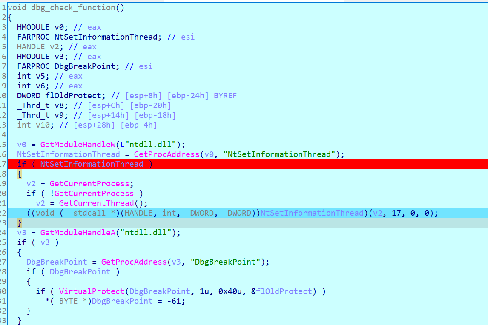
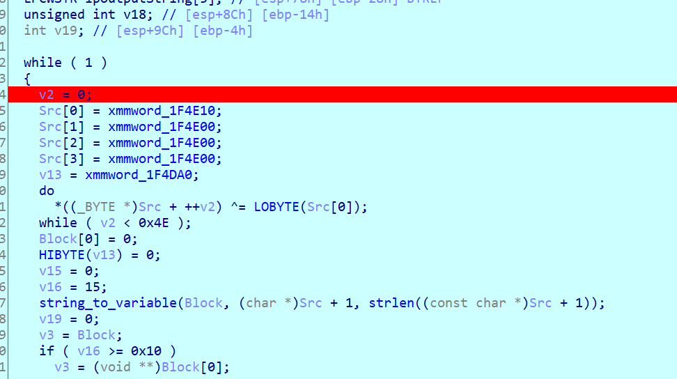
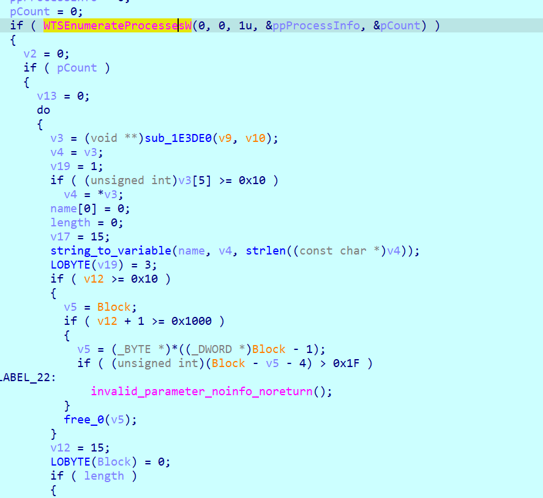
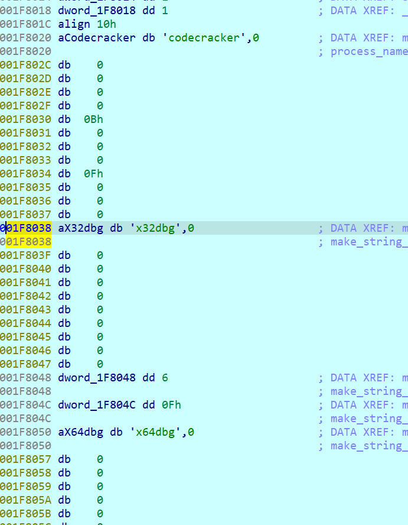
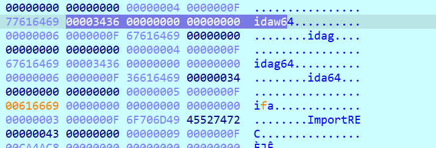
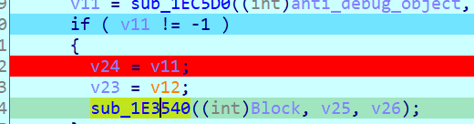
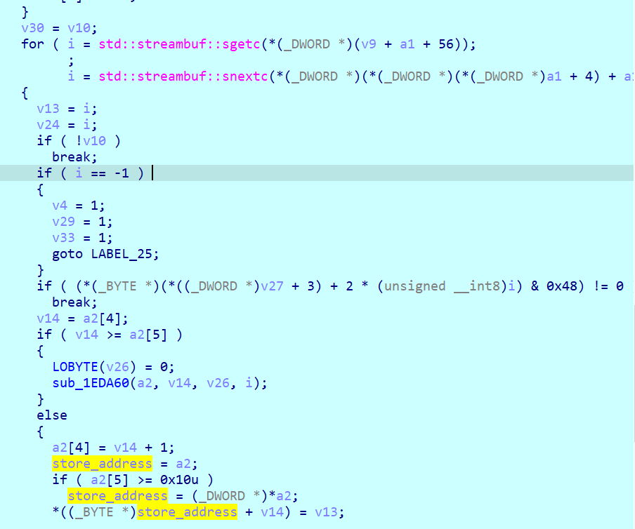
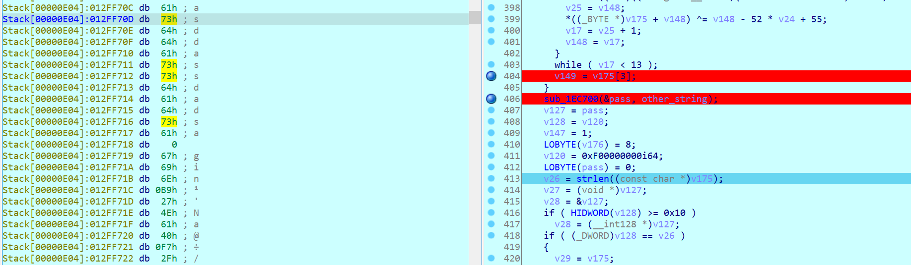

heysurfer's first crackme


ida comment :
repeatable ;
function comments ;
Other stuff:https://hex-rays.com/blog/igor-tip-of-the-week-14-comments-in-ida/


001F1000

sub_1F2000
sub_1F1000
001E7A02

https://unprotect.it/technique/ntsetinformationthread/




ntsetinformationthread 17 is ThreadHideFromDebugger 

https://stackoverflow.com/questions/57118618/anti-debugger-technique-how-to-hide-a-thread-from-the-debugger-using-vb-net


```typedef enum _THREADINFOCLASS {

    ThreadHideFromDebugger=17

} THREADINFOCLASS;

extern "C" ULONG __stdcall NtSetInformationThread(
    __in HANDLE ThreadHandle,
    __in THREADINFOCLASS ThreadInformationClass,
    __in_bcount(ThreadInformationLength) PVOID ThreadInformation,
    __in ULONG ThreadInformationLength
);

ULONG main()
{
    ULONG Status;

    Status=NtSetInformationThread(GetCurrentThread(), ThreadHideFromDebugger, NULL, 0);

    if(Status)
        printf("Error with NtSetInformationThread : 0x%xn", Status);

    __asm {int 3}
    return 0; 
}```

https://anti-debug.checkpoint.com/techniques/interactive.html :
The function ntdll!NtSetInformationThread() can be used to hide a thread from a debugger. It is possible with a help of the undocumented value THREAD_INFORMATION_CLASS::ThreadHideFromDebugger (0x11). This is intended to be used by an external process, but any thread can use it on itself.

After the thread is hidden from the debugger, it will continue running but the debugger won’t receive events related to this thread. This thread can perform anti-debugging checks such as code checksum, debug flags verification, etc.

However, if there is a breakpoint in the hidden thread or if we hide the main thread from the debugger, the process will crash and the debugger will be stuck.

In the example, we hide the current thread from the debugger. This means that if we trace this code in the debugger or put a breakpoint to any instruction of this thread, the debugging will be stuck once ntdll!NtSetInformationThread() is called.


Furthermore the following function tries to patch dbgbreakpoint:
The function ntdll!DbgBreakPoint() has the following implementation:


It is called when a debugger attaches to a running process. It allows the debugger to gain control because an exception is raised which it can intercept. If we erase the breakpoint inside ntdll!DbgBreakPoint(), the debugger won’t break in and the thread will exit.

```C/C++ Code

void Patch_DbgBreakPoint()
{
    HMODULE hNtdll = GetModuleHandleA("ntdll.dll");
    if (!hNtdll)
        return;

    FARPROC pDbgBreakPoint = GetProcAddress(hNtdll, "DbgBreakPoint");
    if (!pDbgBreakPoint)
        return;

    DWORD dwOldProtect;
    if (!VirtualProtect(pDbgBreakPoint, 1, PAGE_EXECUTE_READWRITE, &dwOldProtect))
        return;

    *(PBYTE)pDbgBreakPoint = (BYTE)0xC3; // ret
}
```


furthermore an anti-debug thread is launched


the program is making a list of processes that are running



Afterwards the process checks with the help of an object, which has all the names of the blacklisted processes in it



we change the name of ida and x32


or we can patch the verification sequence



Because I was bored and the process kept trowing anti-debug stuff at me I decided to just suspend the threads that were making the checks. This worked.

The main thread reads input char by char and stores it in the second argument space


discovered one of the passwords
Type Password : asddassdadsa
NICE FK



asddassdadsa is the key.
