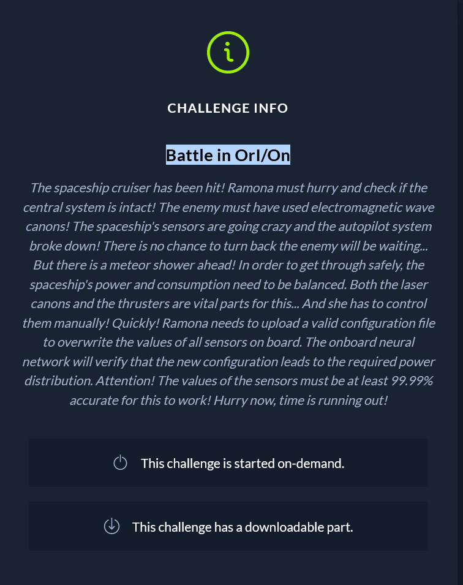
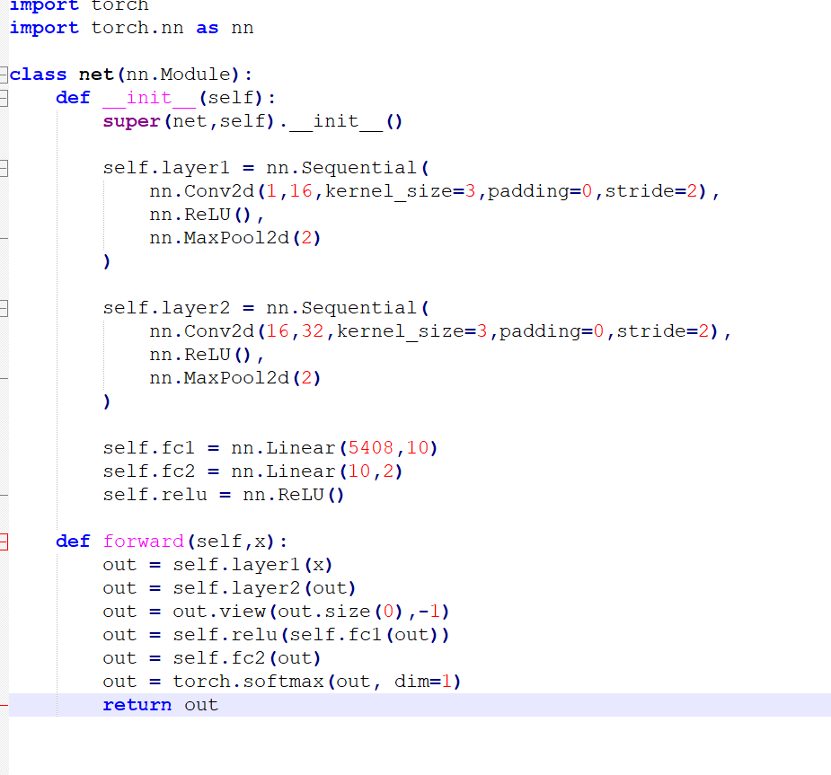
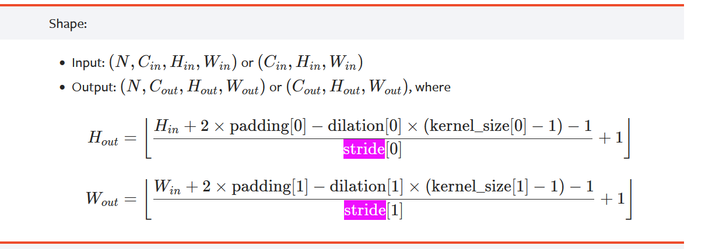
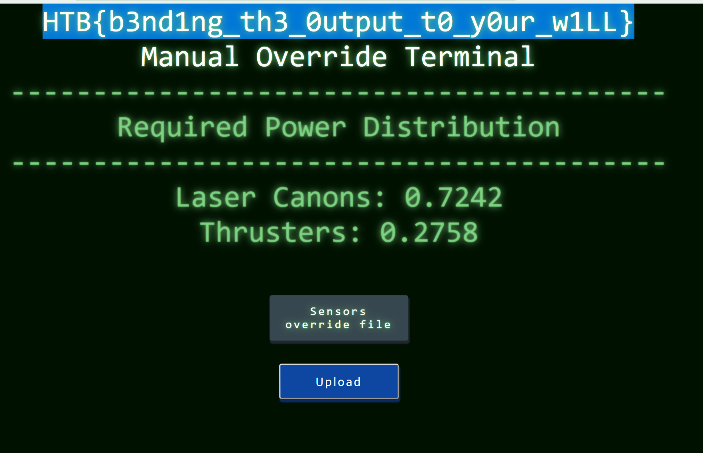

The spaceship cruiser has been hit! Ramona must hurry and check if the central system is intact! The enemy must have used electromagnetic wave canons! The spaceship's sensors are going crazy and the autopilot system broke down! There is no chance to turn back the enemy will be waiting... But there is a meteor shower ahead! In order to get through safely, the spaceship's power and consumption need to be balanced. Both the laser canons and the thrusters are vital parts for this... And she has to control them manually! Quickly! Ramona needs to upload a valid configuration file to overwrite the values of all sensors on board. The onboard neural network will verify that the new configuration leads to the required power distribution. Attention! The values of the sensors must be at least 99.99% accurate for this to work! Hurry now, time is running out!

In order to solve this challenge we need to look at what the defenses have as a neural network.

From this we must construct an input that passed through the neural network gives an output (2 numbers x>0 and x<1) that we control. Basically our loss is constituted by how the output of the model differs from the target output.
The model does not require gradient
we first must find the input sizes. For this we must understand how a cnn works:

in_channels (int) — Number of channels in the input image

out_channels (int) — Number of channels produced by the convolution

kernel_size (int or tuple) — Size of the convolving kernel

stride (int or tuple, optional) — Stride of the convolution. Default: 1

padding (int or tuple, optional) — Zero-padding added to both sides of the input. Default: 0

dilation (int or tuple, optional) — Spacing between kernel elements. Default: 1

The formula for the layer can be found here:
https://pytorch.org/docs/stable/generated/torch.nn.Conv2d.html

linear shape dimension is 5408, so that is the size that our input must have when reaching that layer.
We divide that by 32 and square the result, giving us 13. The output of the last convolutional layer is 13. The max pooling layer divides the output of the convolutional layer by 2 so we have 26 at the output of the second nn.conv2d.

The formula for the conv2d is outlined above, following it we have height=53 when entering the second layer. Then moving into the next layer we need to have 106 by the time we go into the output of the first convolutional layer and then 213 at the begining of the input layer. Because these numbers get rounded along the way we took the minimum approach. The input will be between 213 -> 2xx. 
By trying the different numbers we find that the number is 244.
We turn on the server and receive the answer  

The partial code to calculate the adversarial 
<code>

print(model)
model.eval()

model.fc = torch.nn.Identity()
X = np.zeros((1, 1, 224, 224))
x = torch.tensor(X, requires_grad=True)
model(x.float())[0]
while True:

    # Calculate embeddings of given image
    y_pred = model(a)[0]
    
    # Calculate loss against target embeddings
    loss = ((y_pred - answer)**2).mean()
    clear_output(wait=True)
    data_optimizer.zero_grad()
    print(loss, flush=True)
    loss.backward()
    data_optimizer.step()
    if loss.item() < 1e-14:
        print(f"Nice! Here's the flag: ")
        break

    saving:
    numpyarray=a.detach().numpy()
    np.save(r'result.npy', numpyarray)
</code>

