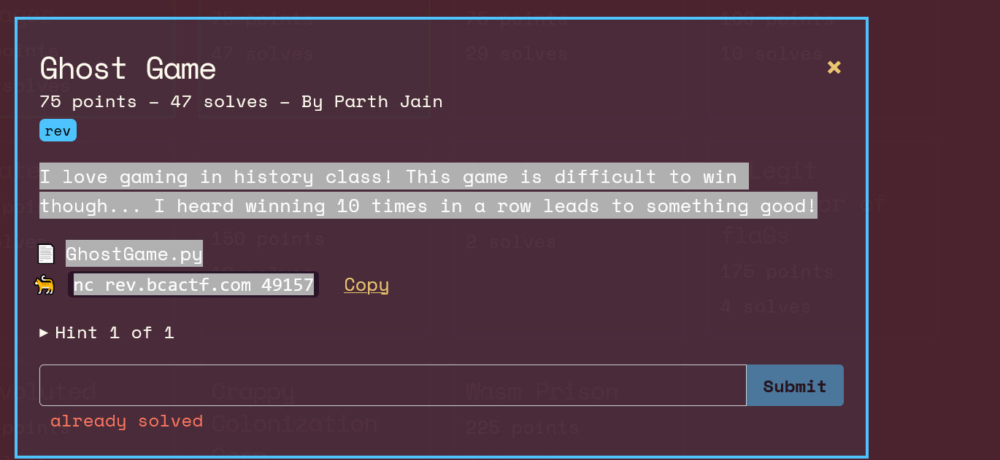

BCACTF-BROKEN IMAGE

My friend said that he made a really cool drawing in MS Paint but I can't open it! Maybe my computer is broken? Or the image? I really don't know. Could you try opening it for me and telling me what it is?
Although the image is supposed to be broken, you can open it in autopsy or ms paint.

bcactf{br0k3n_1m4g3_4nd_1m4g3_4nd_1m4g3}

My New Friend
This is my new pen pal! He sent me this handsome picture of himself. Unfortunately, I forgot his name. Can you help me figure it out?
After getting nothing with the strings command you can try different tools online for steganography. you find it using https://stylesuxx.github.io/steganography/

Superglue
I accidentally glued my images together. Please help!
Hex editor watch for jfif and png separate the images profit

So the first thing we have to find is the jpg file header FF D8 FF E0 then we find the trailer FFD9 
We find the png file header 89 50 4E 47 and the footer 49 45 4E 44
Gif file header GIF89a and the footer 3B
The last file is webp file we can deduce that by looking at the WEBPVP8L which is after the RIFF header
bcactf{ch3_2_co_to_d155olv3}

BCACTF 3.0: The Movie
A terrible movie remake of BCACTF? What's not to like?!
Load the movie frame by frame and remove the transparent layer, there are letters there
bcactf{im_sorry_111111111111}
bcactf{im_sorry_1l11l1l1l11l}

.bcapng
BCACTF's latest creation: an image file format! It can represent black and white pixels, and isn't too efficient. The problem is, someone sent me a .bcapng file and I lost the program to view it. Could you tell me what it is?
"""
a=open('k:/chall.bcapng').read()
rows,columns,text=a[1:-1].split('_')
rows=int(rows)
columns=int(columns)
temp=rows
rows=columns
columns=temp
text2=text.replace('1',' ')
for i in range(rows):
    print(text2[i*columns:(i+1)*columns])
    """

bcactf{B3Tt3r_tH4N_pnG_56jvCf9P}

Blender Creation
150 points 14 solves By Krish

I'm learning how to use Blender, and if I'm being honest I have no idea what I'm doing. Here's a render of something I made, not exactly sure what it is though.

Open image there is a script at the end. Run the script in blender change the viewport there is the flag
or you can run the script until variable yrssth is populated.
bcactf{b13NdR__pXYtH0N_4ND_f0r3N}

Zoinked
Open the zip in a hex editor see that the header is messed up put the pk header (\x50\x4b\x03\x04) profit

Agent Rocket

Agent Rocket
75 points 76 solves By Shay Mor

    webex 

I need to launch the BCA CTF ROCKET to the moon! Unfortunately I lost my launch code (flag). You can find the launch code in the control panel.

Looking at the source is all you need. The first source file gives you the name and password and the next tells you should login from a device called BCACTF Rocket Control Panel so change your useragent for the post and you get the flag

Zoinked2
Zoinked Zip 2
175 points 17 solves By Yusuf

    foren 

Okay, look. I know I already asked you to help me, but I accidentally threw a magnet onto my hard drive again. Unfortunately, some of my files got corrupted again, but I'm positive you can fix this zip file for me. Can you take a look again?

So if you're getting tired of all these header matchers there is a way to automate zip file repair use winrar option. Get the flag, profit
bcactf{y0u_4r3_4_m4st3r_z1pp15t_Hd8h3FBysb}

Ghost door

I love gaming in history class! This game is difficult to win though... I heard winning 10 times in a row leads to something good!

    GhostGame.py
    nc rev.bcactf.com 49157

The seed is given so you need to generate 10 numbers and input them to get the flag

Password Manager
I forgot my password to the password checker which is stored in the password checker which I forgot the password to! Here's my password checker, can you help me remember the password?
Invert the dictionary and iterate through it to get the password

Glassed Over
75 points 47 solves By Mudasir

    rev 

I created a new way to hide images, see if you can reverse it and find the flag.

    modifiedflag.png
    index.js

after reading the javascript we can make a python script to evidentiate the flag

import cv2
import numpy as np
import matplotlib.pyplot as plt

img = cv2.imread(r'k:/modifiedflag.png',cv2.IMREAD_COLOR)
img[...,1] += 129
img[...,0] += 68
cv2.imshow('graycsale image',img)

cv2.waitKey(0)

cv2.destroyAllWindows()

bcactf{b!gG3r_!mg_29354758}

Bitshuffle
Bit Shuffling
100 points 20 solves By Marvin

    rev 

I made a program to perfectly shuffle my deck of bits. Could you put them back in order again?

    shuffle.py
    shuffled

bcactf{D3R1FFLED_C8G3A2P47}

Wasm Prison
To leave the prison, enter the flag.

    http://web.bcactf.com:49208/

This challenge is about reversing wasm code.

While looking at the code. We see that the file forms a list of functions which it then calls as you give it input by index. The index is formed by xoring the input in decimal with 137. After looking at each function, after the first 7 digits, it multiplies the digit with 1337 adds the current number of verified strings and 1 and then compares with the string in a data location.
Decryption function:

th3_1nd1r3ct_PR1S0N_95c3b0