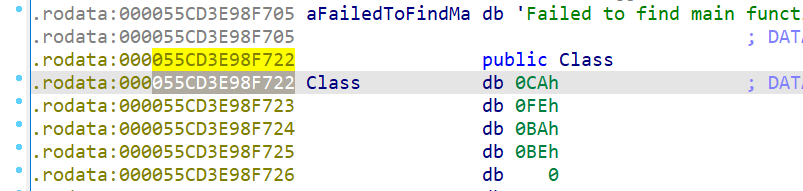

Extracting an object from memory using Ida Pro
For the purpose of this tutorial I will be 
object beginning 

object length
import ida_bytes
data = ida_bytes.get_bytes(0x55CD3E98F722, 0x752)
file_descriptor = open('dump_space', 'wb')
file_descriptor.write(data)
file_descriptor.close()

This will save your input to a file.
If you want to see what code you have selected use:
import idc
print(hex(idc.read_selection_start()))