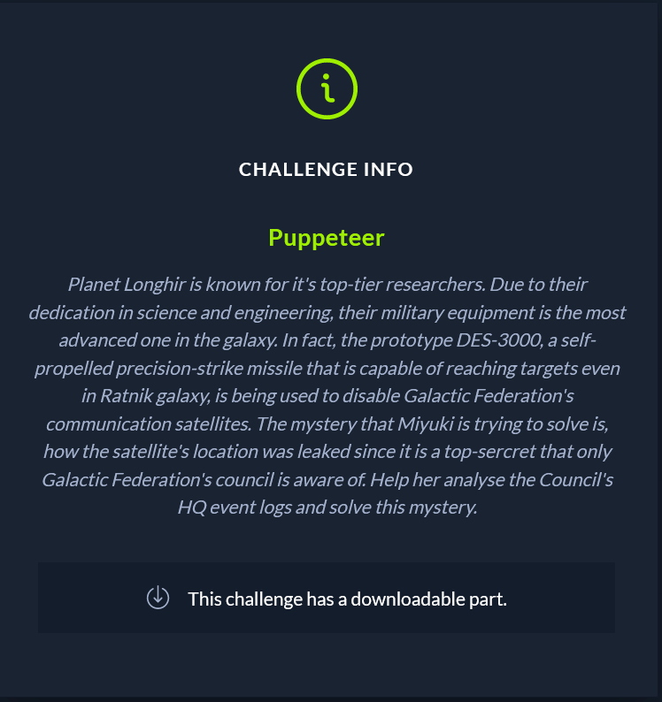
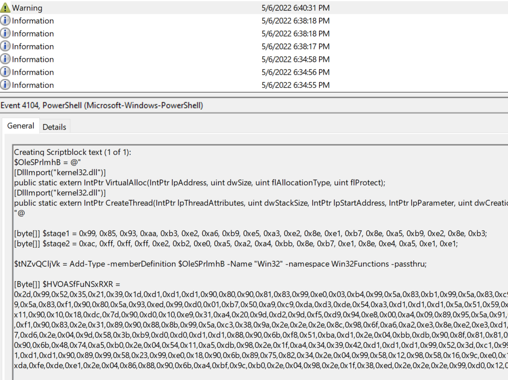

Planet Longhir is known for it's top-tier researchers. Due to their dedication in science and engineering, their military equipment is the most advanced one in the galaxy. In fact, the prototype DES-3000, a self-propelled precision-strike missile that is capable of reaching targets even in Ratnik galaxy, is being used to disable Galactic Federation's communication satellites. The mystery that Miyuki is trying to solve is, how the satellite's location was leaked since it is a top-sercret that only Galactic Federation's council is aware of. Help her analyse the Council's HQ event logs and solve this mystery.

The attached files are some .evtx files. Seeing as this is a forensics challenge, we need to browse these events. I checked for brute force, and then powershell scripts. The file Microsoft-Windows-PowerShell%4Operational.evtx contains the script in question.

We begin to decode the scripts, we see that stage1 is a hex blob and then xored with 0xd1.
By xoring it we get the first half of the flag HTB{b3wh4r3_0f_th3_b. The next half is in stage2, we reverse and xore it and we get the second part of the flag.