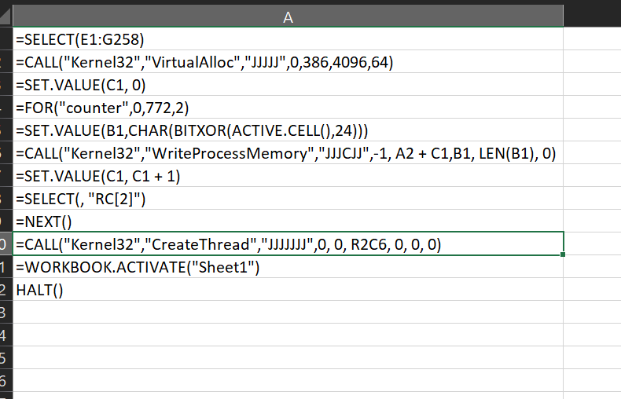
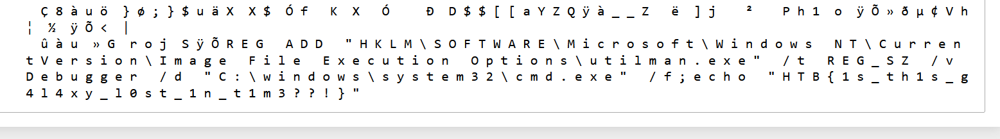
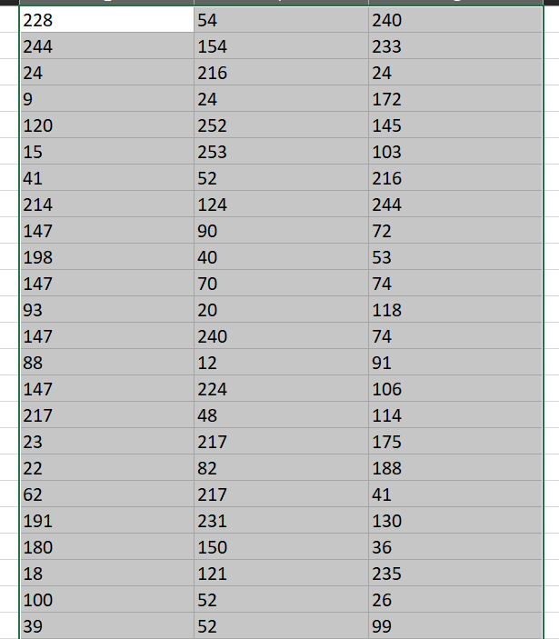

Intergalactic Federation stated that it managed to prevent a large-scale phishing campaign that targeted all space personnel across the galaxy. The enemy's goal was to add as many spaceships to their space-botnet as possible so they can conduct distributed destruction of intergalactic services (DDOIS) using their fleet. Since such a campaign can be easily detected and prevented, malicious actors have changed their tactics. As stated by officials, a new spear phishing campaign is underway aiming high value targets. Now Klaus asks your opinion about a mail it received from "sales@unlockyourmind.gal", claiming that in their galaxy it is possible to recover it's memory back by following the steps contained in the attached file.

We see that some wierd code is present in this excel window, and suspicious numbers are presented near to them

By following the instructions we get the flag.

So in order to obtain the flag we have to xor with key 24 while iterating the elements 2 at a time (1,3,5,7...) and discarding the even elements.
The elements are taken from the excel file

from left to right and then from up to bottom.
<code>
k=0
for i in a:
    if k>0:
        k=0
        continue
    print(chr(i^24), end=' ')
    k+=1
</code>