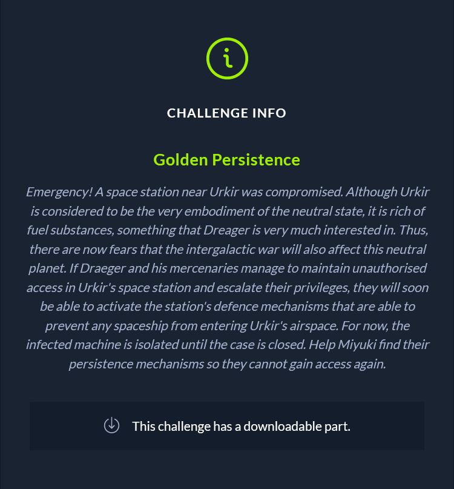
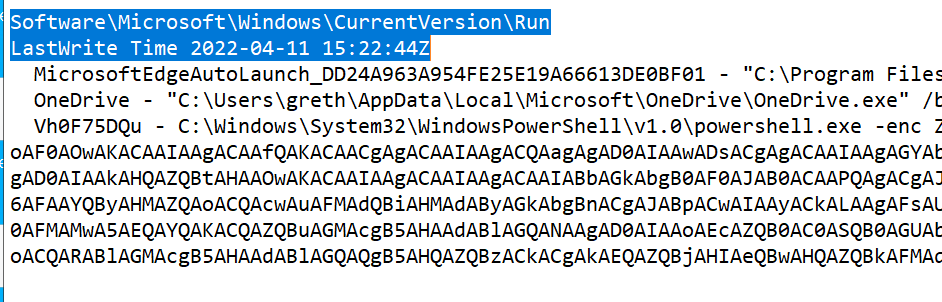
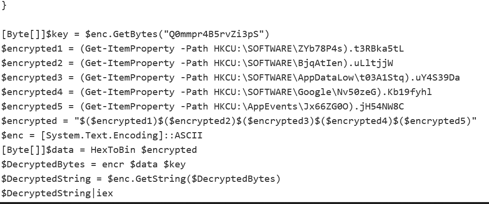
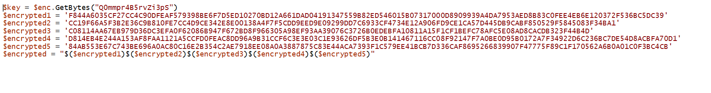
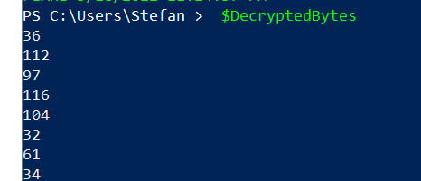
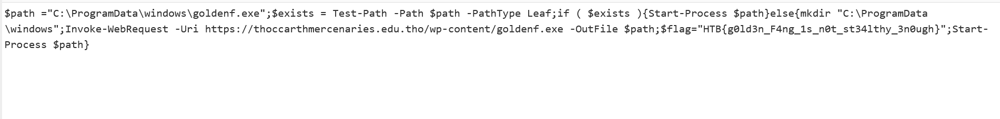

Emergency! A space station near Urkir was compromised. Although Urkir is considered to be the very embodiment of the neutral state, it is rich of fuel substances, something that Dreager is very much interested in. Thus, there are now fears that the intergalactic war will also affect this neutral planet. If Draeger and his mercenaries manage to maintain unauthorised access in Urkir's space station and escalate their privileges, they will soon be able to activate the station's defence mechanisms that are able to prevent any spaceship from entering Urkir's airspace. For now, the infected machine is isolated until the case is closed. Help Miyuki find their persistence mechanisms so they cannot gain access again.

For this challenge we need to use registry explorer and registry ripper in order to make our life easier.
Using registry ripper we extract the interesting persistance indicators from the registry hive.

By decoding the base64 we get the actual powershell. The powershell gets information from aditional registers and then the flag is among the decrypted strings. In order to retrieve the registers we use registry explorer.

After we retrieve the registers we input them into the program

We use the decrypt functionality of the powershell script and we obtain the decimal representation of the final part of the script:

After decoding that representation we get the actual flag

