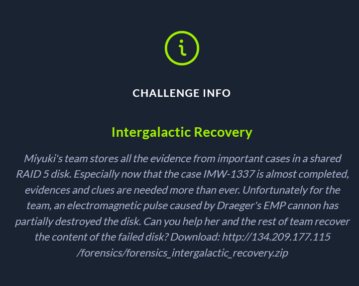
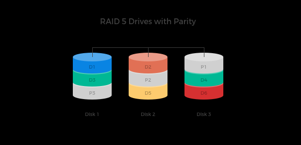
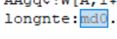
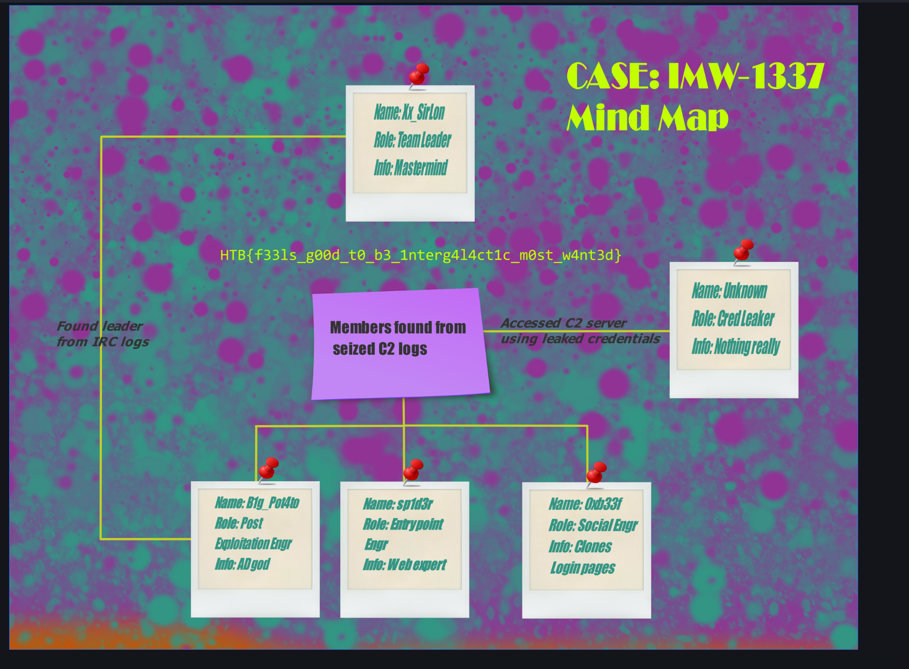

Miyuki's team stores all the evidence from important cases in a shared RAID 5 disk. Especially now that the case IMW-1337 is almost completed, evidences and clues are needed more than ever. Unfortunately for the team, an electromagnetic pulse caused by Draeger's EMP cannon has partially destroyed the disk. Can you help her and the rest of team recover the content of the failed disk? Download: http://134.209.177.115/forensics/forensics_intergalactic_recovery.zip

By downloading the zip file in the challenge we discover that only 2 of the three raid drives are intact. If we try to mount them as is, then drive 3 will fail on mount. The next step i made is a very logical thing, researching about how raid5 works.

So we have parity on the other drives and in order to obtain disk3 we can xor disk1 and disk2. The image above is only partially correct. The sections are not contiguous, they are stripes of data. so if we have a block size of 1k and we don't have an offset into the drives (which is a false assumption for this case, and is only used to explain the process of writing data to a raid5 array). The first 1k will go to the first drive, the second 1k will go to the second drive and then the third drive will be the xor result of the 2k of data. The process repeats on a block to block basis, the parity drive changes. There are also more ways of writing data to a RAID5 device, but for our case this is the way it was done. I reconstructed the disk 3 using xor of the first two drives and then by brute forcing the mount operation I got the flag, but not before trying to reconstruct the raid using a python script, which failed because i didn't consider the offset. To find the drive offset you have to open it in a hex editor and look for clues, the challenge's clues were:

This suggests that the drive was mounted 0.
The mounting order was 231.
The pdf inside had this image.
Other rabbit hole was OSPForensics which kind of combines raid 5 arrays into a raid 0 but that wasted a good portion of my day.
The commands to mount the drive are:
sudo losetup /dev/loop1 disk1.img
sudo losetup /dev/loop2 disk2.img
sudo losetup /dev/loop3 disk3.img
sudo mdadm --create /dev/md0 --level=0 --raid-devices=3 /dev/loop2 /dev/loop3 /dev/loop1 

