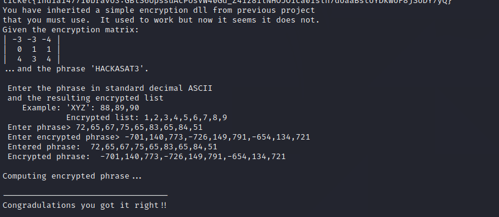
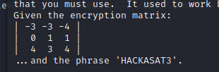
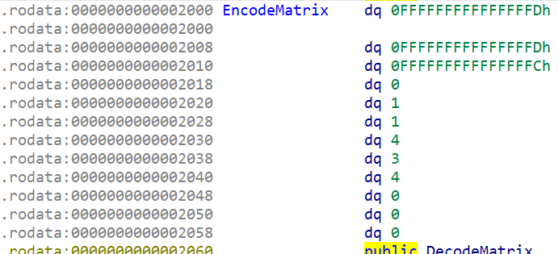
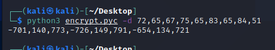
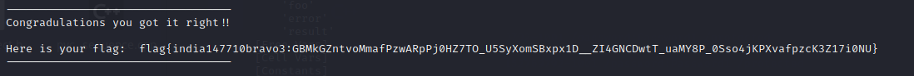

It's A Wrap is a challenge about reading decompiled python and semi uncompyled python script and then correlating the information with a so library in order to get the flag

You need to insert the passphrase as ascii and the encrypted output

Load the libraries and the dll 

<code>from ctypes import c_void_p, cdll
from numpy.ctypeslib import ndpointer
import numpy as np
from ctypes import *
libfoo = CDLL("./libfoo.so")</code>

We see that we are given an encryption matrix:

We see the same numbers as the exported matrix in the library file:

So the only thing that we need to do is to run the python file and we get the input for the server

But I didn't do that, I reversed the python file and made my own input such as in the presented code below. Part of the reverse was done by pycdc (reveals source code but fails on some of it) and a part by pycdas which (reveals the python disassembly and it's complete).
<code>
np.zeros((3,3),'int')
encr=np.zeros((3,3),'int')
phrase=np.zeros((3,1),'int')
s=encr.ctypes.data_as(ctypes.POINTER(ctypes.c_uint32))
c=0
phrase='HACKASAT3'
phrase=[ord(i) for i in phrase]
phrasearray=np.asarray(phrase,'int')
ph=phrasearray.ctypes.data_as(ctypes.POINTER(ctypes.c_uint32))
pointer=c_voidp.in_dll(libfoo,'EncodeMatrix')
encrypted_array=np.asarray([-3,-3,-4,0,1,1,4,3,4],'int').reshape((3,3))
data_pointer=libfoo.encrypt_it(ph,s)
data_pointer=libfoo.encrypt_it(ph)
data_pointer[:9]
data_pointer = ctypes.cast(data_pointer,ctypes.POINTER(ctypes.c_int))
data_pointer[:9]
[-701, -1, 140, 0, 773, 0, -726, -1, 149]
phrase
[72, 65, 67, 75, 65, 83, 65, 84, 51]
data_pointer=libfoo.encrypt_it(ph)
data_pointer = ctypes.cast(data_pointer,ctypes.POINTER(ctypes.c_longlong))
data_pointer[:9]
[-701, 140, 773, -726, 149, 791, -654, 134, 721]</code>

Using the output from the code we input it into the server input field and that's it.

