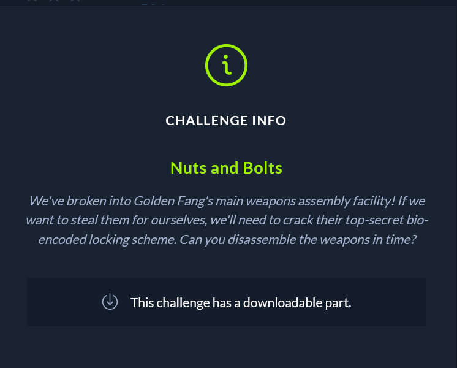
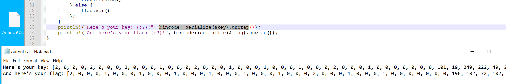
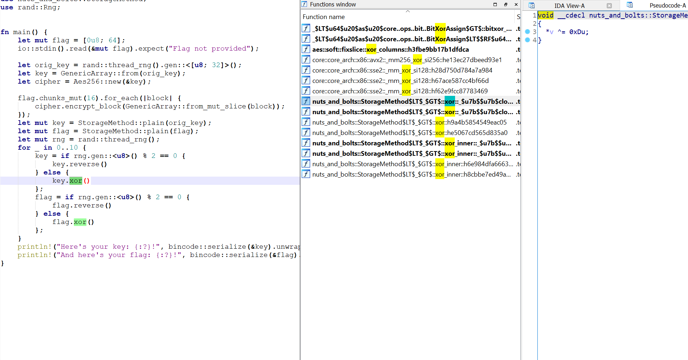
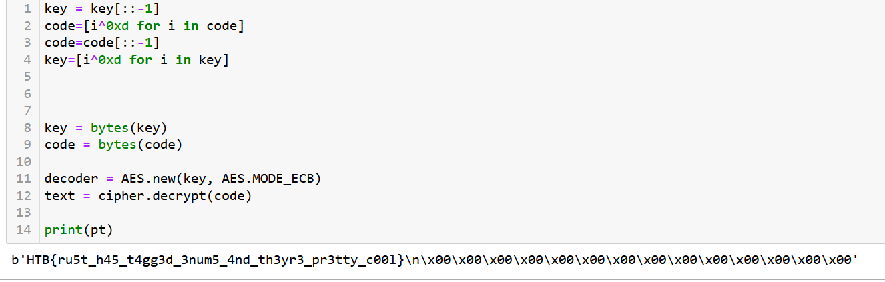

Nuts and Bolts
We've broken into Golden Fang's main weapons assembly facility! If we want to steal them for ourselves, we'll need to crack their top-secret bio-encoded locking scheme. Can you disassemble the weapons in time?

Looking at the code this challenge is very easy, because it's just a rust script.

The junk you see before any real information is the product of the bincode:serialize. We can decrypt the payload with a python script.

By looking at the binary included in the challenge we see that the xor operation is done using 0xD byte.
We reverse the operations and get the flag
