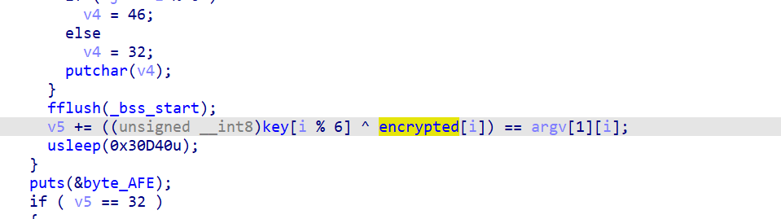
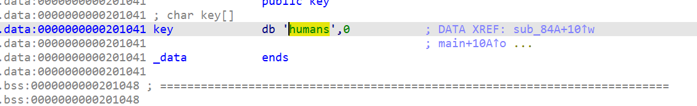
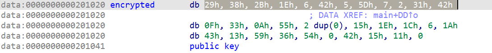
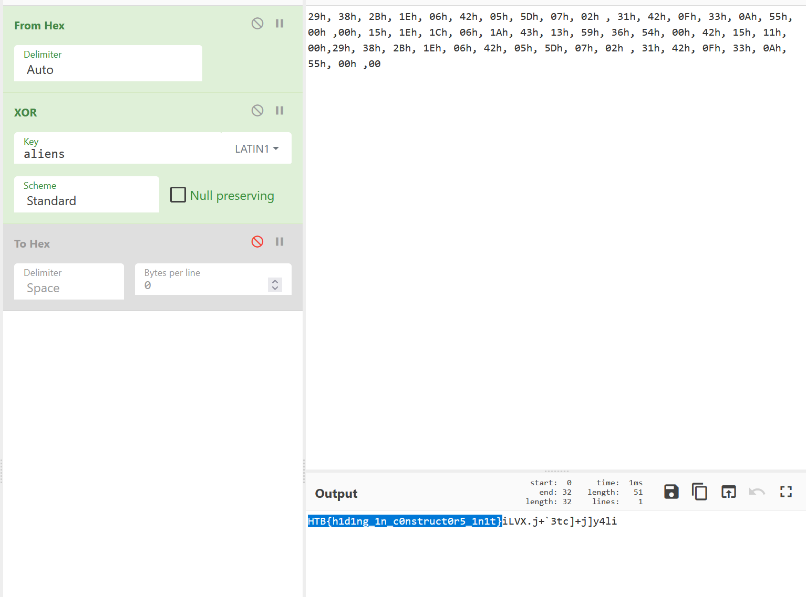
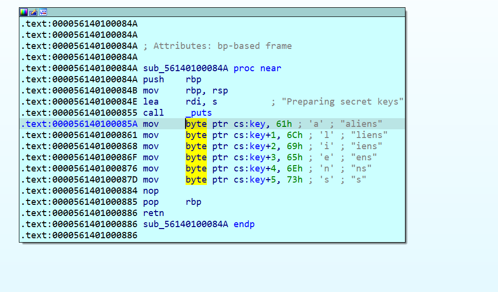
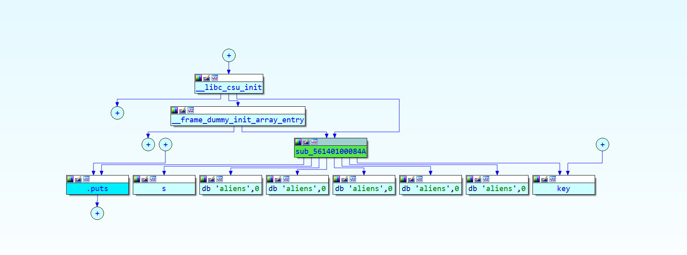
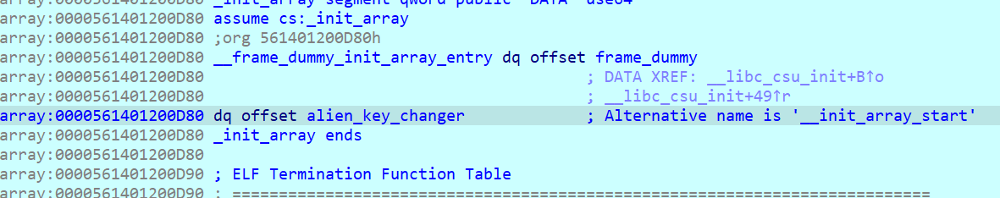

You arrive on a barren planet, searching for the hideout of a scientist involved in the Longhir resistance movement. You touch down at the mouth of a vast cavern, your sensors picking up strange noises far below. All around you, ancient machinery whirrs and spins as strange sigils appear and change on the walls. You can tell that this machine has been running since long before you arrived, and will continue long after you're gone. Can you hope to understand its workings?
This challenge is very simple as well. It has a key and an encrypted string.

"humans" is the key, it is obtained by looking at the memory that stores it.

Also the encrypted array is present in memory:

We decrypt the encrypted content with the true key. The key can be either obtained by reversing the binary or by knowing that the flag starts with HTB{ .

HTB{h1d1ng_1n_c0nstruct0r5_1n1t}
In order to see which function changes the key we look for references to that memory region.
We find one:

Then we analyse the execution flow that gets us there 

The key change happens because of the init function array that gets executed before main

Now is a good moment to read up on init functions in executables:
So basically we have 3 arrays and the names are really self explanatory of what they do. The c code looks like this:
<code>
#include <stdio.h>

static void preinit(int argc, char **argv, char **envp) {
    puts(__FUNCTION__);
}

static void init(int argc, char **argv, char **envp) {
    puts(__FUNCTION__);
}

static void fini(void) {
    puts(__FUNCTION__);
}

__attribute__((section(".preinit_array"), used)) static typeof(preinit) *preinit_p = preinit;
__attribute__((section(".init_array"), used)) static typeof(init) *init_p = init;
__attribute__((section(".fini_array"), used)) static typeof(fini) *fini_p = fini;

int main(void) {
    puts(__FUNCTION__);
    return 0;
}
</code>