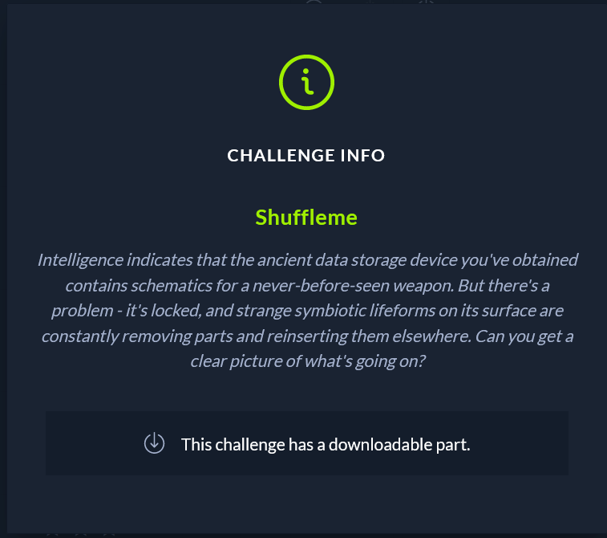

Intelligence indicates that the ancient data storage device you've obtained contains schematics for a never-before-seen weapon. But there's a problem - it's locked, and strange symbiotic lifeforms on its surface are constantly removing parts and reinserting them elsewhere. Can you get a clear picture of what's going on?

This challenge consists of static analyzing a binary and figuring out how it encrypts data. (AES CBC).

The iv is 0 as per:

We decrypt the blob and get the flag:
HTB{sw4pp1ng_h3r3_4nd_sw1tch1ng_th3r3-1t5_m0r3_th4n_1_c4n_b34r!}