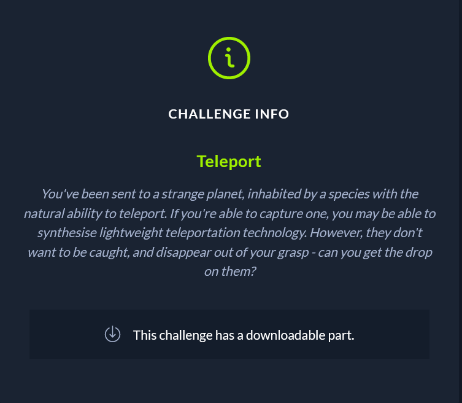

You've been sent to a strange planet, inhabited by a species with the natural ability to teleport. If you're able to capture one, you may be able to synthesise lightweight teleportation technology. However, they don't want to be caught, and disappear out of your grasp - can you get the drop on them?

This exercise can either take a while or be very easy depending on your approach. I kind of took a shortcut by debugging it and then looking there your input is stored in the .bss section.

Looking at the refferences to each byte reveals the correct flag for example 

HTB{h0pp1ng_thru_th3_sp4c3_t1m3_c0nt1nuum!}