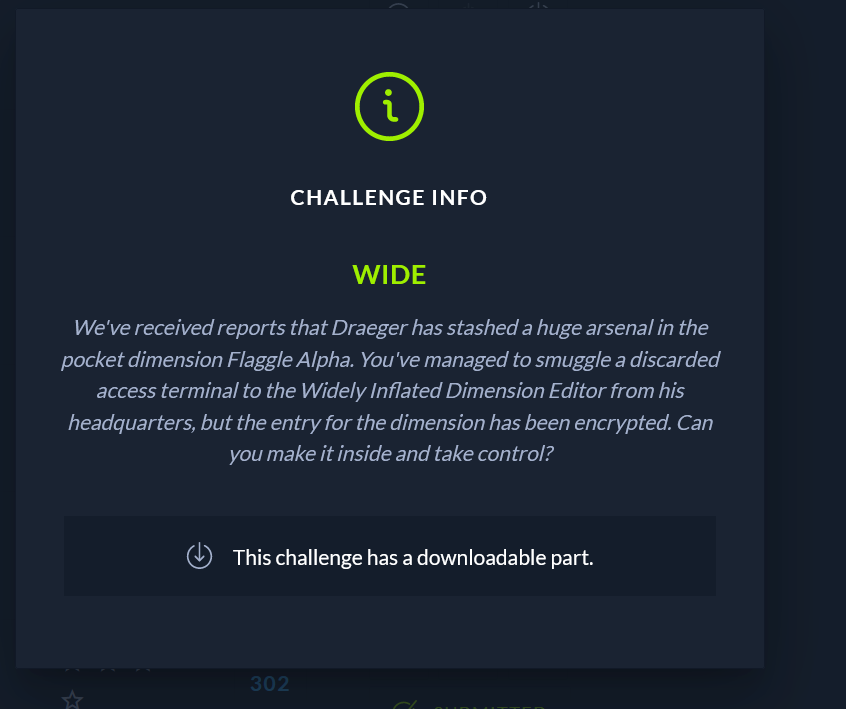
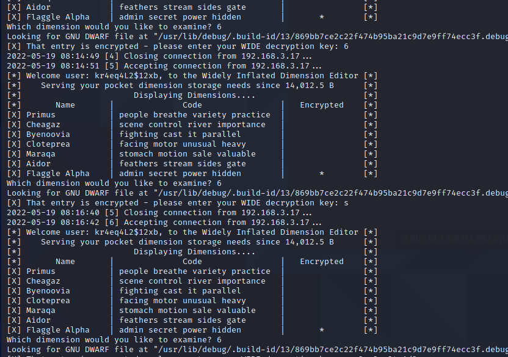
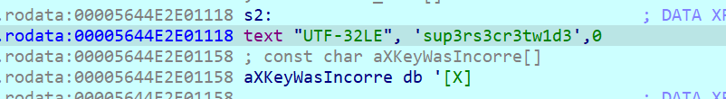
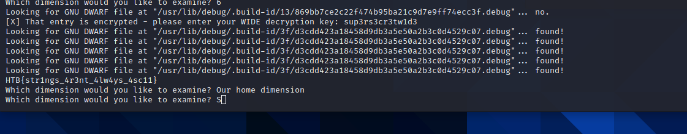

We've received reports that Draeger has stashed a huge arsenal in the pocket dimension Flaggle Alpha. You've managed to smuggle a discarded access terminal to the Widely Inflated Dimension Editor from his headquarters, but the entry for the dimension has been encrypted. Can you make it inside and take control?

This reverse is easy, opening the file with the Ida debugger we can see that the app has a menu,

By examining the menu we see that the last selection is encrypted, and it asks us a password.
Navigating to that part in ida we see that the read password is compared with something that begins with an "s". We discover that the string is misrepresented by ida and it is in fact another string. After converting the string (CTRL-A to open the menu and select whatever has 32 bits)

Then enter the password in the prompt either wide or normal chars and enjoy the flag

HTB{str1ngs_4r3nt_4lw4ys_4sc11}