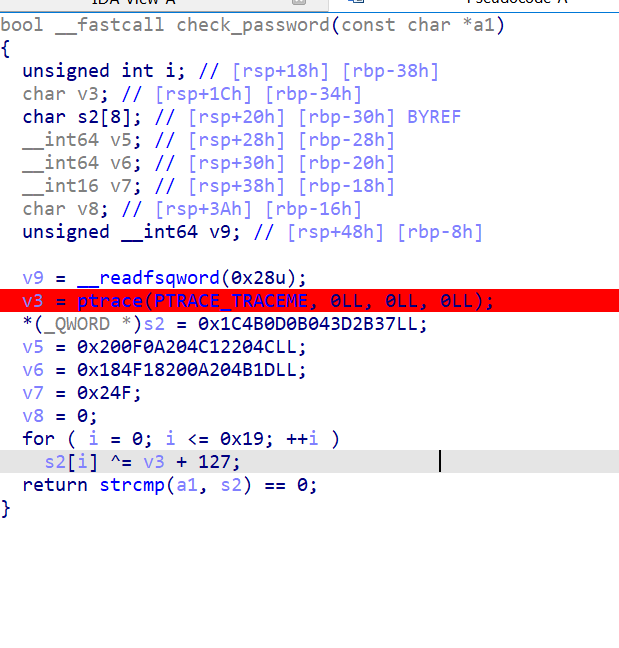
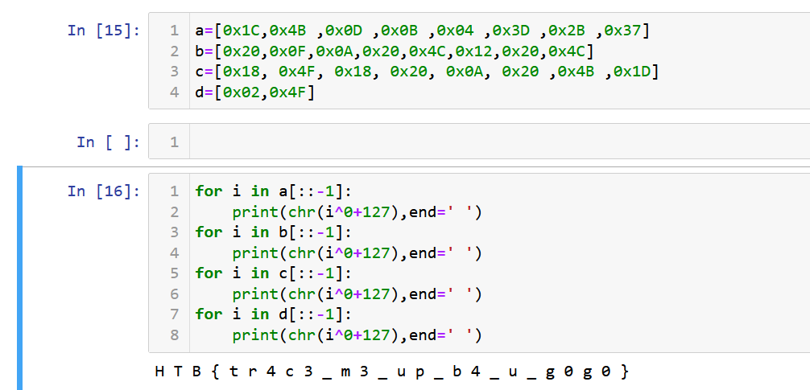

Draeger's mothership has suddenly vanished, he could be readying an attack! You need to track him down before disaster strikes...

This challenge is easy as well.
we look at the check_password function and see that the password is compared with the block of hex initialized above. The ptrace should return 0 if the process is not being debugged.

H T B { t r 4 c 3 _ m 3 _ u p _ b 4 _ u _ g 0 g 0 } 
This should be the moment to read up on the ptrace function.
https://man7.org/linux/man-pages/man2/ptrace.2.html
Ptrace is a system call that one process can use to observe another one.
The most important parameters are:
On success, ptrace() shall return the requested data for PTRACE_PEEK requests, or zero for all other requests. On error, all requests return -1. So in our case if the process is not being debugged returns 0.

        PTRACE_TRACEME
              Indicate that this process is to be traced by its parent.
              A process probably shouldn't make this request if its
              parent isn't expecting to trace it.  (pid, addr, and data
              are ignored.)

              The PTRACE_TRACEME request is used only by the tracee; the
              remaining requests are used only by the tracer.  In the
              following requests, pid specifies the thread ID of the
              tracee to be acted on.  For requests other than
              PTRACE_ATTACH, PTRACE_SEIZE, PTRACE_INTERRUPT, and
              PTRACE_KILL, the tracee must be stopped.

       PTRACE_PEEKTEXT, PTRACE_PEEKDATA
              Read a word at the address addr in the tracee's memory,
              returning the word as the result of the ptrace() call.
              Linux does not have separate text and data address spaces,
              so these two requests are currently equivalent.  (data is
              ignored; but see NOTES.)

       PTRACE_PEEKUSER
              Read a word at offset addr in the tracee's USER area,
              which holds the registers and other information about the
              process (see <sys/user.h>).  The word is returned as the
              result of the ptrace() call.  Typically, the offset must
              be word-aligned, though this might vary by architecture.
              See NOTES.  (data is ignored; but see NOTES.)

       PTRACE_POKETEXT, PTRACE_POKEDATA
              Copy the word data to the address addr in the tracee's
              memory.  As for PTRACE_PEEKTEXT and PTRACE_PEEKDATA, these
              two requests are currently equivalent.

       PTRACE_POKEUSER
              Copy the word data to offset addr in the tracee's USER
              area.  As for PTRACE_PEEKUSER, the offset must typically
              be word-aligned.  In order to maintain the integrity of
              the kernel, some modifications to the USER area are
              disallowed.

       PTRACE_GETREGS, PTRACE_GETFPREGS
              Copy the tracee's general-purpose or floating-point
              registers, respectively, to the address data in the
              tracer.  See <sys/user.h> for information on the format of
              this data.  (addr is ignored.)  Note that SPARC systems
              have the meaning of data and addr reversed; that is, data
              is ignored and the registers are copied to the address
              addr.  PTRACE_GETREGS and PTRACE_GETFPREGS are not present
              on all architectures.

       PTRACE_GETREGSET (since Linux 2.6.34)
              Read the tracee's registers.  addr specifies, in an
              architecture-dependent way, the type of registers to be
              read.  NT_PRSTATUS (with numerical value 1) usually
              results in reading of general-purpose registers.  If the
              CPU has, for example, floating-point and/or vector
              registers, they can be retrieved by setting addr to the
              corresponding NT_foo constant.  data points to a struct
              iovec, which describes the destination buffer's location
              and length.  On return, the kernel modifies iov.len to
              indicate the actual number of bytes returned.

       PTRACE_SETREGS, PTRACE_SETFPREGS
              Modify the tracee's general-purpose or floating-point
              registers, respectively, from the address data in the
              tracer.  As for PTRACE_POKEUSER, some general-purpose
              register modifications may be disallowed.  (addr is
              ignored.)  Note that SPARC systems have the meaning of
              data and addr reversed; that is, data is ignored and the
              registers are copied from the address addr.
              PTRACE_SETREGS and PTRACE_SETFPREGS are not present on all
              architectures.

       PTRACE_SETREGSET (since Linux 2.6.34)
              Modify the tracee's registers.  The meaning of addr and
              data is analogous to PTRACE_GETREGSET.

       PTRACE_GETSIGINFO (since Linux 2.3.99-pre6)
              Retrieve information about the signal that caused the
              stop.  Copy a siginfo_t structure (see sigaction(2)) from
              the tracee to the address data in the tracer.  (addr is
              ignored.)
