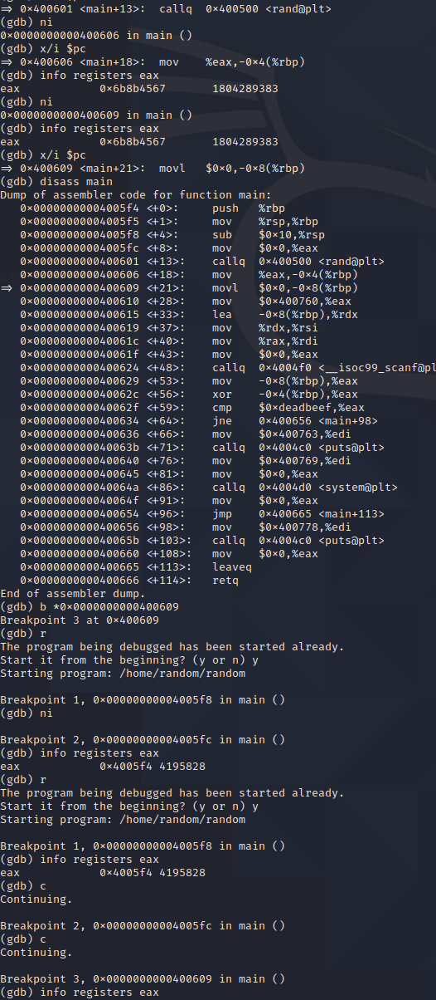

random 

info registers to see registers in gdb
display/i $pc
info registers rax

flag  random  random.c
random@pwnable:~$ cat random.c
#include <stdio.h>

int main(){
        unsigned int random;
        random = rand();        // random value!

        unsigned int key=0;
        scanf("%d", &key);

        if( (key ^ random) == 0xdeadbeef ){
                printf("Good!\n");
                system("/bin/cat flag");
                return 0;
        }

        printf("Wrong, maybe you should try 2^32 cases.\n");
        return 0;
}

random@pwnable:~$ exit()
> q

0x6b8b4567^0xdeadbeef=key

key=0xb526fb88
>>> hex(0x6b8b4567^0xdeadbeef)
'0xb526fb88'
>>> str.encode(str(0xb526fb88))
b'3039230856'
>>>

Mommy, I thought libc random is unpredictable...