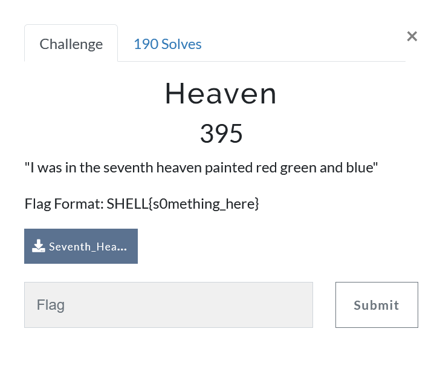
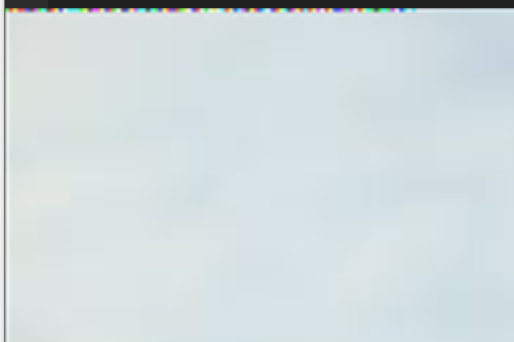
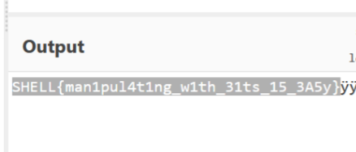

Conspiracy theory challenge for steganography



We are given a picture with a few broken pixels at the top which i assumed was heaven:   



After trying multiple tactics such as msb lsb and stuff i reread the challenge which said `"I was in the seventh heaven painted red green and blue"`   

So i thought i would have to look at the few first pixels if they are red green or blue   

```import cv2
 

img = cv2.imread('k:/Seventh_Heaven_Image.jpeg')
img = cv2.cvtColor(img, cv2.COLOR_BGR2RGB)
(img[:1,:20,:])```   

We see the following array
```array([[[ 87, 219,  90],
        [216,  92,  91],
        [216, 220,  91],
        [216,  92,  91],
        [217,  93,  92],
        [ 89,  93, 220],
        [ 89,  93,  92],
        [218,  94, 221],
        [ 91, 223,  94],
        [ 91, 223, 222],
        [ 91,  95,  94],
        [219,  95,  94],
        [219, 223,  94],
        [ 91,  95, 222],
        [219, 223, 222],
        [ 90, 224, 222],
        [ 90, 224, 222],
        [ 90, 224, 224],
        [ 90, 224,  96],
        [218, 224,  96]]], dtype=uint8)
```


In order to get info i thought we put a 100 limit on pixels and see which goes over and which does not:`(img[:1,:20,:]>100)*1`  

which gives us the following output:  
```0 1 0 1 0 0 1 1 0 1 0 0 1 0 0 0 0 1 0 0 0 1 0 1 0 1 0 0 1 1 0 0 0 1 0 0 1
 1 0 0 0 1 1 1 1 0 1 1 0 1 1 0 1 1 0 1 0 1 1 0 0 0 0 1 0 1 1 0 1 1 1 0 0 0
 1 1 0 0 0 1 0 1 1 1 0 0 0 0 0 1 1 1 0 1 0 1 0 1 1 0 1 1 0 0 0 0 1 1 0 1 0
 0 0 1 1 1 0 1 0 0 0 0 1 1 0 0 0 1 0 1 1 0 1 1 1 0 0 1 1 0 0 1 1 1 0 1 0 1
 1 1 1 1 0 1 1 1 0 1 1 1 0 0 1 1 0 0 0 1 0 1 1 1 0 1 0 0 0 1 1 0 1 0 0 0 0
 1 0 1 1 1 1 1 0 0 1 1 0 0 1 1 0 0 1 1 0 0 0 1 0 1 1 1 0 1 0 0 0 1 1 1 0 0
 1 1 0 1 0 1 1 1 1 1 0 0 1 1 0 0 0 1 0 0 1 1 0 1 0 1 0 1 0 1 1 1 1 1 0 0 1
 1 0 0 1 1 0 1 0 0 0 0 0 1 0 0 1 1 0 1 0 1 0 1 1 1 1 0 0 1 0 1 1 1 1 1 0 1
 ```


This when decoded:  


