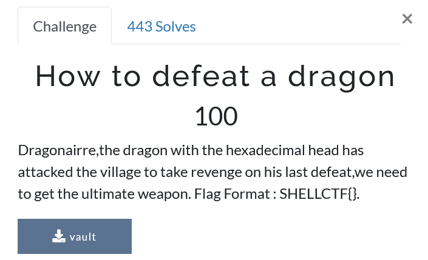
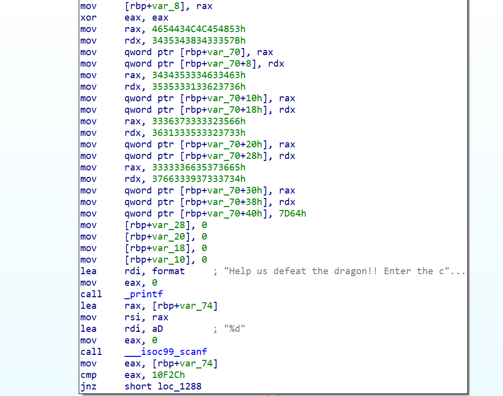
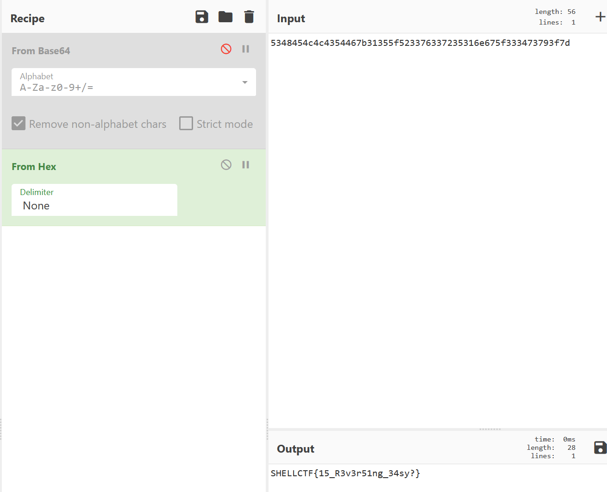

Getting hex from the program and converting it twice to string easy rev

Dragonairre,the dragon with the hexadecimal head has attacked the village to take revenge on his last defeat,we need to get the ultimate weapon. Flag Format : SHELLCTF{}.

We see that the execution flow is very simple:

The input is compared with 69420 and if we input that the flag is printed, the flag is also encoded in the hex code above:

Converting the hex from the flag we get the real flag:
