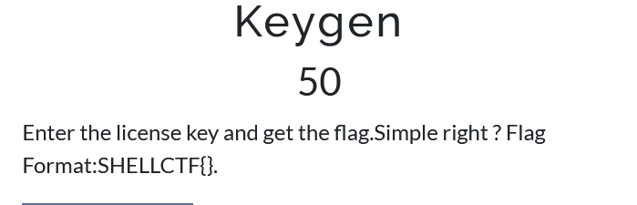
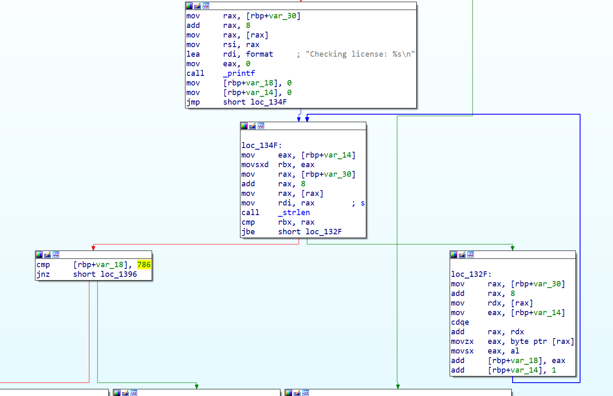
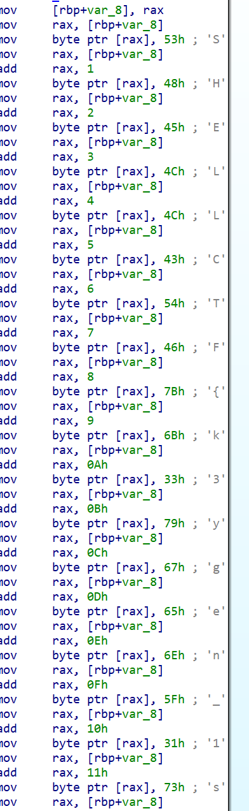

Binary embedded flag in clear rev easy

There are two ways to solve this challenge:

First way is to look at the keygen ( you have to input a password and it gets checked for length and compares the sum of the letters to 786):

If you don't feel like it you can go to get_string function and get the flag in clear.

SHELLCTF{k3ygen_1s_c0oL}