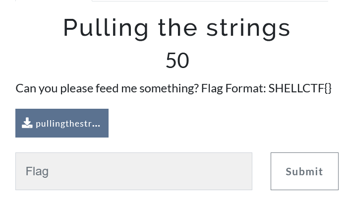
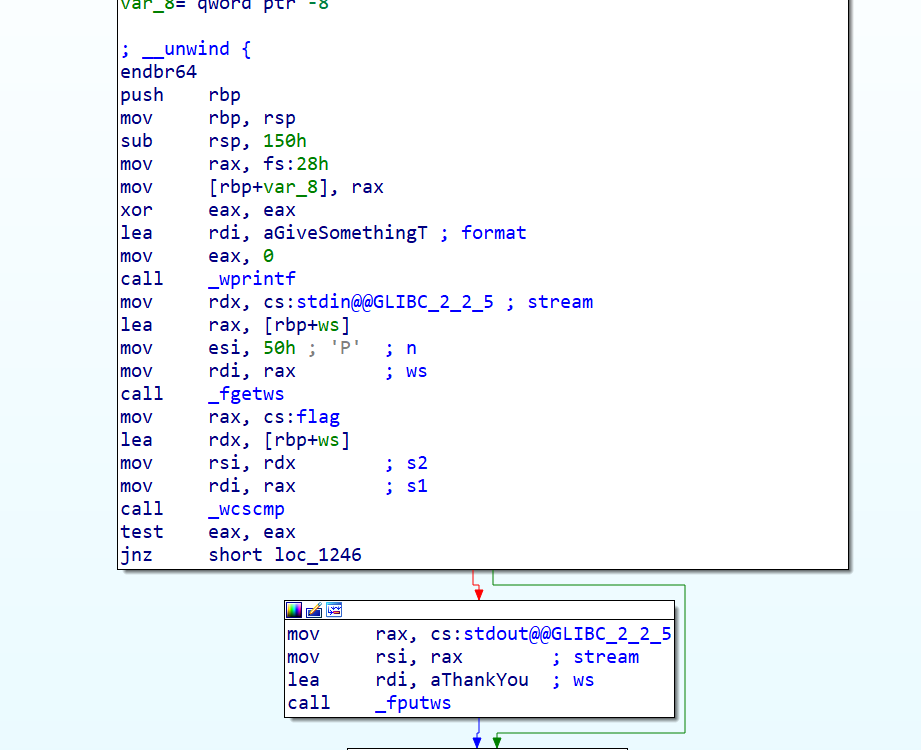
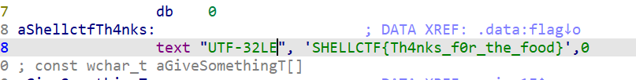

Following references to stuff and easy program flow

This binary is very simple as well, it has a comparison and then if it is true it gives us a thank you message.

Finding the reference to the flag variable, we find the flag itself.

