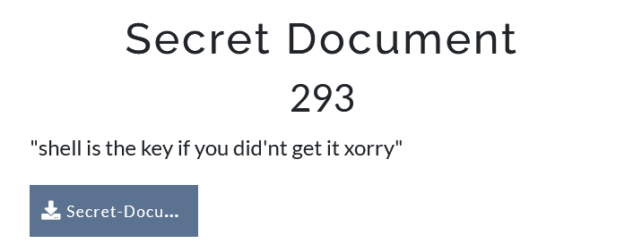
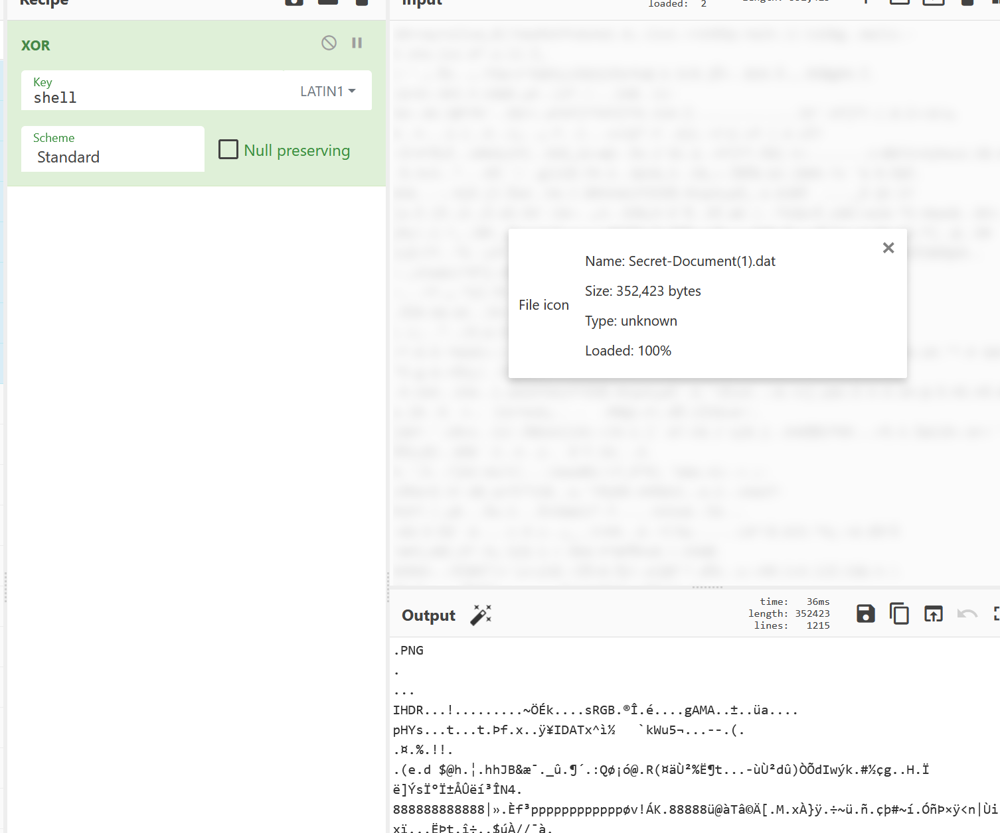

Document xoring with given key, easy for

This is a very easy challenge

We take the document xor it with shell and then we get the following picture:

We then see that it is a png by magic number:  

open and get flag:

