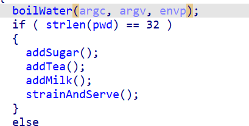

Reversing operations to embedded flag rev easy

We need to reverse all the operations that are done by the executable in order to reverse the flag embedded in it.



First there is a switch operation, this makes all the odd characters in one list and even in another and concatenates them:

Python equivalent:

```
def switch(passw):
    a=[]
    b=[]
    for j,i in enumerate(passw):
        if j%2==0:
            a+=i
        else:
            b+=i
    return b+a

```

We make a reverse equivalent:

```
def unswitch(passw):
    a=[]

    index=len(passw)//2
    for i in range(len(passw)//2):
        a.append(passw[index+i])
        a.append(passw[i])
    return a

```

The next part adds an amount to every letter, there are two halves of the function for each half of input:

Python equivalent
```
def scramble(switched):
    scrambled=[]
    i=0
    while True:
        a=i
        if a>=len(switched)//2:
            break
        scrambled += [chr(ord(switched[i]) + 3 * int(i / -2))]
        i+=1
    for i in range(int(len(switched)/2),len(switched)):
        scrambled += [chr(ord(switched[i]) + int(i/6))]
    return scrambled
    

```

Reverse Python function:

```
def unscramble(switched):
    scrambled=[]
    i=0
    while True:
        a=i
        if a>=len(switched)//2:
            break
        scrambled += [chr(ord(switched[i]) - 3 * int(i / -2))]
        i+=1
    for i in range(int(len(switched)/2),len(switched)):
        scrambled += [chr(ord(switched[i]) - int(i/6) )]
    return scrambled

```

The last operation mixes the flag in 3 parts depending on the first `5` and the first `R`.

In order to unmix the flag we make this function:
```
second_pass='50gYhugow~34i'
dispute='R;crc75ihl`cNYe`]m%'
for i in range(1,len(dispute)):
    last_part=dispute[:i]
    first_part=dispute[i:]
    stringd=first_part+second_pass+last_part
    print(''.join(unswitch(unscramble(stringd))))
```
We don't know where the first part begins because it does not have a delimiter, instead we only know the second part which begins at 5, that is why we have a for in the function above

shellctf{T0_1nfiNi7y_4nD_B3y0nd}

