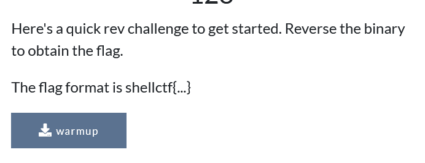
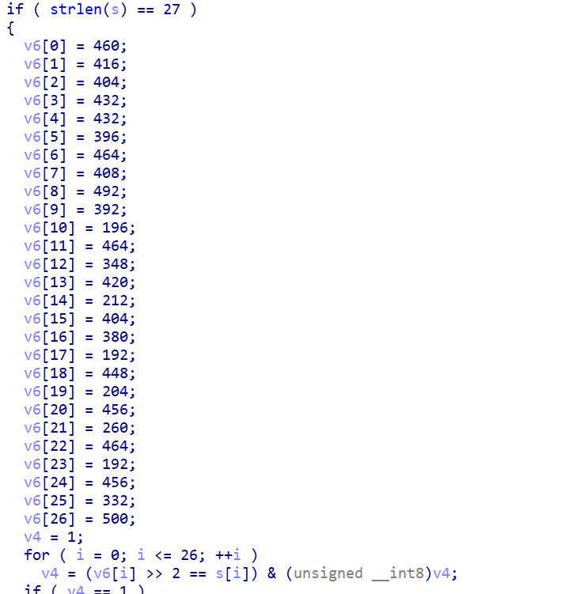

Getting string from challenge and then doing bitwise operations in reverse easy rev



This challenge is straightforward as well, in order to get the flag you only need to do a bitwise operation:



```
a=[460,416,404,432,432,396,464,408,492,392,196,464,348,420,212,404,380,192,448,204,456,260,464,192,456,332,500]
for i in a:
    print(chr(int(i/4)),end='')
```
Gives us:  
`shellctf{b1tWi5e_0p3rAt0rS}`